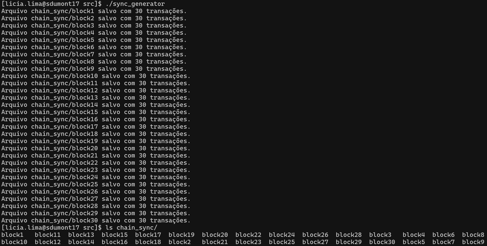
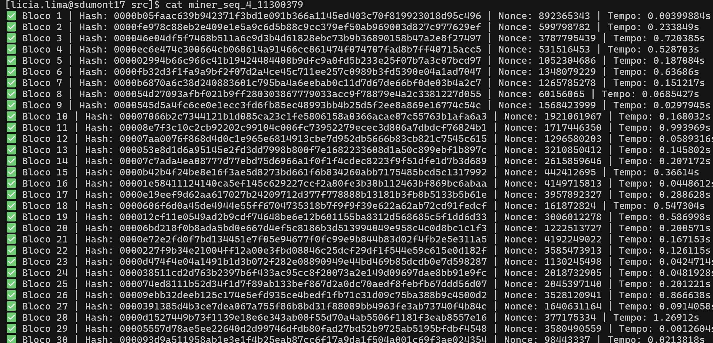
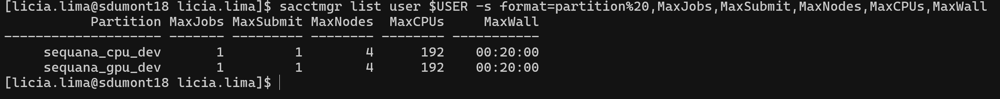

# Projeto - Minerador de Hashes em GPU

Este projeto é um minerador de hashes em **C++** que simula um processo de **proof-of-work** similar ao usado na mineração de criptomoedas. O código permite a **busca de um hash válida** a partir de transações lidas de arquivos e a tentativa de encontrar um **nonce correto** para gerar um hash que atenda a um critério de dificuldade.

No repositório tem três implementações prontas:

- Um minerador **sequencial** de transações **síncronas**
- Um gerador de **transações**, com 30 transações fixas.

### Para executar o gerador de transações:

```cpp
./generator
```

Você deve ter uma saída parecida com essa:



O conteúdo de cada bloco é:

```cpp
ID: tx_1
Timestamp: 2025-03-28 11:24:55
Conteúdo: txcVfYs819MPNETO9zPS
Hash: 435a03ab073f14a6f80591affbfde6b98d1945de0749e633f1e2c9ff34f8b06d
...
...
...
ID: tx_30
Timestamp: 2025-03-28 11:24:55
Conteúdo: w5sNqOPnBNm4iwnQeXS3
Hash: c96958b686b92597528f3666e56963b62194a4bdaa2ecee3329f4f6c47fb577c

```

### Para realizar a mineração sequêncial

Garanta que os módulos estão carregados:

Compile o código e gere o binário:

```cpp
g++ miner.cpp -o miner
```
No SDumont, o comando abaixo solicita pelo slurm:

- 1 CPU,
- 1 tarefa por CPU,
- por 20 minutos (tempo máximo disponível na fila sequana_cpu_dev),
- salva o output em miner_id_do_job
- Executa o miner com 3 zeros a esquerda

```cpp
time srun   --partition=sequana_cpu_dev   --nodes=1   --ntasks-per-node=1   --time=00:20:00  --output=miner_%j   .
/miner 3
```
Dentro do arquivo de output você deve ver algo como:



Se você der o comando no terminal do SDumont:

```cpp
sacctmgr list user $USER -s format=partition%20,MaxJobs,MaxSubmit,MaxNodes,MaxCPUs,MaxWall
```

Terá acesso aos recursos habilitados para uso com o seu login:




## **Entrega**

A entrega deve incluir um **relatório técnico** descrevendo de forma clara:

* as **estratégias de otimização aplicadas** no código, justificando as escolhas de cada abordagem;
* as **métricas de desempenho** utilizadas (tempo de execução, throughput, etc.);
* os **ganhos de desempenho obtidos**, com evidências experimentais (gráficos, tabelas).

O relatório deve refletir o raciocínio crítico sobre o impacto das otimizações no uso da GPU e a eficiência paralela alcançada.


| **Conceito** | **Critérios**                                                                                                                                                                                                                                                                                                                                                                 |
| ------------ | -------------------------------------------------------------------------------------------------------------------------------------------------------------------------------------------------------------------------------------------------------------------------------------------------------------------------------------------------------------------------------------- |
| **C**        | Executa o minerador com paralelismo em GPU, demonstran domínio de boas práticas como minimização de cópias entre CPU e GPU, uso eficiente de buffers, redução de acessos à memória global e implementação de uma heurística eficiente. O código deve atingir dificuldade 7 zeros e realizar a mineração em até **20 minutos** no **Cluster Franky**. |
| **B**        | Executa o minerador com **dificuldade 7 zeros** aplicando **todas as otimizações da rúbrica C**. O experimento deve ser executado no **supercomputador Santos Dumont**, completando a mineração de todos os blocos em no máximo **15 minutos**.                                                                                        |
| **A**        | Executa o minerador com **dificuldade 7 zeros**, aplicando **todas as otimizações da rúbrica C**. O experimento deve ser executado no **supercomputador Santos Dumont**, completando a mineração de todos os blocos em no máximo **5 minutos**.                                                                                        |
| **A+**        | Executa o minerador com **dificuldade 8 zeros**, aplicando **todas as otimizações da rúbrica C**. O experimento deve ser executado no **supercomputador Santos Dumont**, completando a mineração de todos os blocos em no máximo **1 hora e 35 minutos**.                                                                                        |


 
